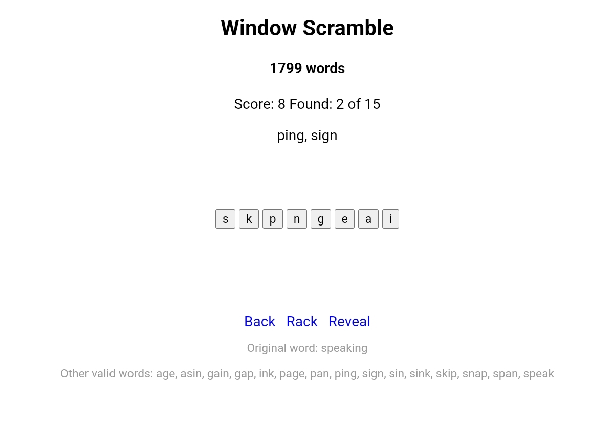

<h1><a href="https://bacionejs.github.io/scramble/" style="text-decoration: none; color: inherit;">Play</a></h1>

# 📜 **Scramble Instructions**
Scramble that gets 1799 words internally from javascript window object.

- Letters can be reused. For example, `lesp` gives `spell`.

Penalties:
- -3 for clicking Rack
- -1 for clicking Back

In otherwords, try to complete a Rack. 
Completely a Rack automatically gives new Rack.
Back (backspace) is also a penalty, try to think the word in your head. Discourages spamming.  

Reveal is free. Maybe I'll make it decrement score for every second it is open.

# Dev Notes
- Splits: camelcase/pascalcase, underscore
- Ignores: numbers, all caps, on-listeners
- Recursion: 3
- Chars: >2
