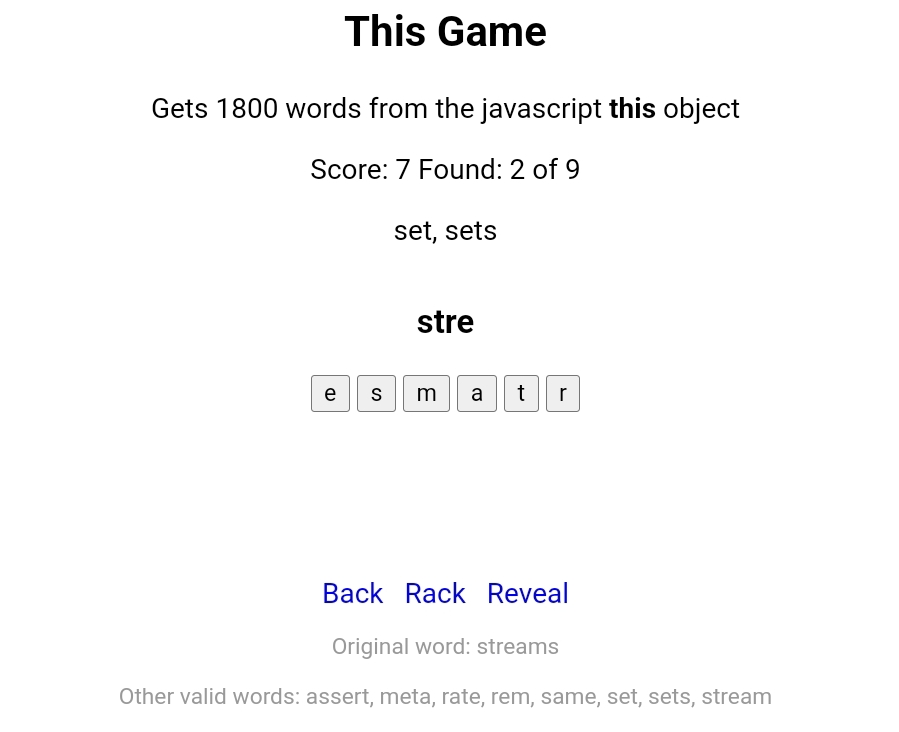

<h1><a href="https://bacionejs.github.io/scramble/" style="text-decoration: none; color: inherit;">Play</a></h1>

# 📜 **Instructions**

- Letters can be reused. For example, `lesp` gives `spell`.

Penalties:
- -1 for clicking Back (discourages spamming)
- -3 for clicking Rack (complete to get new)
- -5 for clicking Reveal

# Dev Notes
- Splits: camelcase/pascalcase, underscore
- Ignores: numbers, all caps, on-listeners
- Recursion: 3
- Chars: >2

# Purpose
Fun experiment, getting words from thin air 😁
